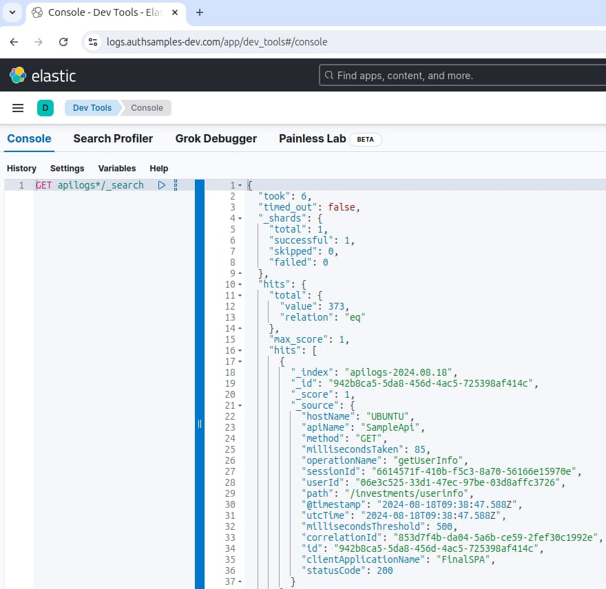

# Final OAuth .NET API

[](https://app.codacy.com/gh/gary-archer/oauth.apisample.netcore?utm_source=github.com&utm_medium=referral&utm_content=gary-archer/oauth.apisample.netcore&utm_campaign=Badge_Grade)

The final OAuth secured .NET API code sample, which returns mock `investments` data:

- The API takes finer control over claims-based authorization to enable security with good manageability.
- The API uses structured logging and log aggregation, for the best supportability.

### API Serves Frontend Clients

The API can run as part of an OAuth end-to-end setup, to serve my blog's UI code samples.\
Running the API in this manner forces it to be consumer-focused to its clients:


### API Security is Testable

The API's clients are UIs, which get user-level access tokens by running an OpenID Connect code flow.\
For productive test-driven development, the API instead mocks the authorization server:


A basic load test fires batches of concurrent requests at the API.\
This further verifies reliability and the correctness of API logs.


### API is Supportable

You can aggregate API logs to Elasticsearch and run [Technical Support Queries](https://github.com/gary-archer/oauth.blog/tree/master/public/posts/api-technical-support-analysis.mdx).



## Local Development Quick Start

To run the code sample locally you must configure some infrastructure before you run the code.

### Configure DNS and SSL

Configure custom development domains by adding these DNS entries to your hosts file:

```bash
127.0.0.1 localhost api.authsamples-dev.com login.authsamples-dev.com
```

Install OpenSSL 3+ if required, create a secrets folder, then create development certificates:

```bash
export SECRETS_FOLDER="$HOME/secrets"
mkdir -p "$SECRETS_FOLDER"
./certs/create.sh
```

If required, configure [Operating system trust](https://github.com/gary-archer/oauth.blog/tree/master/public/posts/developer-ssl-setup.mdx#configure-operating-system-trust) for the root CA at the following location:

```text
./certs/authsamples-dev.ca.crt
```

### Run the Code

- Install a .NET 8+ SDK.
- Also install Docker to run integration tests that use Wiremock.

Then run the API with this command:

```bash
./start.sh
```

### Test the API

Stop the API, then re-run it with a test configuration:

```bash
./testsetup.sh
```

Then run integration tests and a load test:

```bash
./integration_tests.sh
./load_test.sh
```

## Further Details

* See the [API Journey - Server Side](https://github.com/gary-archer/oauth.blog/tree/master/public/posts/api-journey-server-side.mdx) for further information on the API's behaviour.
* See the [Overview Page](https://github.com/gary-archer/oauth.blog/tree/master/public/posts/net-core-code-sample-overview.mdx) for further details on how to run the API.
* See the [OAuth Integration Page](*https://github.com/gary-archer/oauth.blog/tree/master/public/posts/net-core-api-oauth-integration.mdx) for some implementation details.

## Programming Languages

* The API uses C# and .NET.

## Infrastructure

* Kestrel is the HTTP server that hosts the API endpoints.
* AWS Cognito is used as the default authorization server.
* The [jose-jwt](https://github.com/dvsekhvalnov/jose-jwt) library manages in-memory JWT validation.
* The project includes API deployment resources for Docker and Kubernetes.
